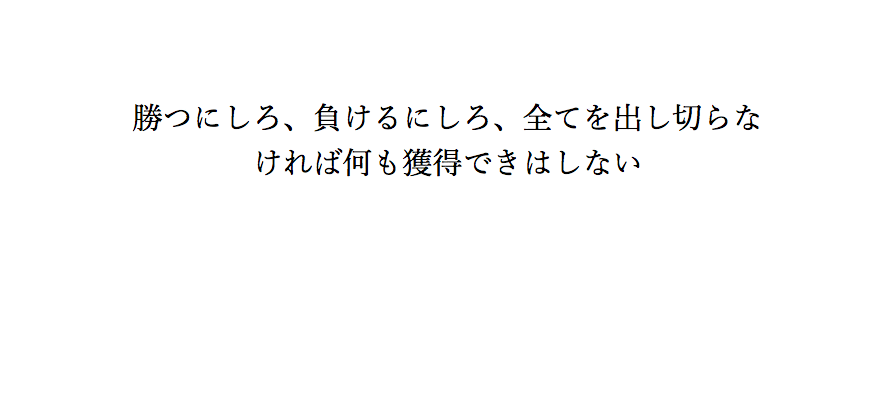

# quotation_extension
[](https://github.com/konifar/fab-transformation/blob/master/LICENSE) [](https://developers.google.com/apps-script/) []() []()  

**Chromeの新規タブにアニメ名言を表示するエクステンション**



## Usage
- このソースコードをZIPでダウンロード
- Chromeの「設定」ページを表示
- 「拡張機能」のデベロッパーモードにチェックを入れる
- 「パッケージ化されていない拡張機能を読み込む」を押し、先ほどダウンロードしたZIPファイルを解答したフォルダを選択
- Chromeで新規タブを開くと、適用されている

## Customize
もし自分の好きなアニメ名言を表示させたい場合は、カスタマイズすることも可能です.

- index.html

```html
<div id="slide">
    <ul>
        <li>勝つにしろ、負けるにしろ、全てを出し切らなければ何も獲得できはしない</li>
        <li>やばいよなあ、本気になるって<br/>帰ってきて、椎名が連載が決まったって聞いたとき、自分が否定されているような気がした<br/>心がくじけそうだった<br/>本気だったから<br/>後悔からも、悔しさからも、逃げも隠れも出来なかった<br/>でも、だったら簡単なんだ<br/>やるしかない<br/> この気持ちをぬぐうにはやるしかない<br/> ダメでもダメでもやるしかない<br/></li>
        <li>世の中に不満があるなら自分を変えろ<br/>それが嫌なら、耳と目を閉じ、口をつぐんで<br/>孤独に暮らせ<br/></li>
        <li>ただがむしゃらに、ひたすら前に進んでた<br/>やりたい事をやり続けていた<br/>そして気が付くとこの年になってた<br/>それだけさ<br/></li>
    </ul>
</div>
```
上記の箇所を自分の好きな名言に変更することでカスタマイズが可能.

## Requirements
- Chrome

## Author
- name : tsuji_takuya
- Gmail : tsujitakuya50@gmail.com
- Twitter : [@Tsuji_Taku50](https://twitter.com/Tsuji_Taku50)

## License

```
MIT License

Copyright (c) 2016 tsuji_takuya

Permission is hereby granted, free of charge, to any person obtaining a copy
of this software and associated documentation files (the "Software"), to deal
in the Software without restriction, including without limitation the rights
to use, copy, modify, merge, publish, distribute, sublicense, and/or sell
copies of the Software, and to permit persons to whom the Software is
furnished to do so, subject to the following conditions:

The above copyright notice and this permission notice shall be included in all
copies or substantial portions of the Software.

THE SOFTWARE IS PROVIDED "AS IS", WITHOUT WARRANTY OF ANY KIND, EXPRESS OR
IMPLIED, INCLUDING BUT NOT LIMITED TO THE WARRANTIES OF MERCHANTABILITY,
FITNESS FOR A PARTICULAR PURPOSE AND NONINFRINGEMENT. IN NO EVENT SHALL THE
AUTHORS OR COPYRIGHT HOLDERS BE LIABLE FOR ANY CLAIM, DAMAGES OR OTHER
LIABILITY, WHETHER IN AN ACTION OF CONTRACT, TORT OR OTHERWISE, ARISING FROM,
OUT OF OR IN CONNECTION WITH THE SOFTWARE OR THE USE OR OTHER DEALINGS IN THE
SOFTWARE.
```
